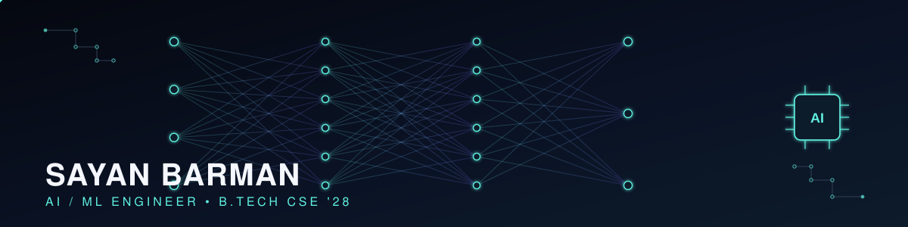

 

 

<!---->

---

## About

I'm **Sayan Barman**, a Computer Science & Engineering student with a strong interest in **Artificial Intelligence, Machine Learning, and Data Science**. I enjoy building intelligent applications that transform data into practical solutions through machine learning, data analysis, and predictive modeling.

My current focus is on strengthening my knowledge of machine learning, deep learning, and model deployment while continuously improving my problem-solving skills through projects and hands-on development.

I am actively seeking opportunities to contribute to impactful AI projects, open-source software, and industry internships.

---

## Technical Skills

 

| Category | Stack |
|---|---|
| **Languages** | Python • C |
| **Machine Learning** | TensorFlow • Scikit-learn • NumPy • Pandas |
| **Tools & Platforms** | Git • GitHub • Jupyter Notebook • VS Code • Linux |
| **Core Concepts** | Machine Learning • Deep Learning • Data Analysis • Data Visualization • Algorithms |

---

## Featured Projects

<table>
<tr>
<td width="50%" valign="top">

### COVID-19 Data Analysis

Exploratory data analysis and visualization of COVID-19 case data to identify trends, growth patterns, and regional spread.

**Tech Stack**

`Python` `Pandas` `Matplotlib`

**Repository**

https://github.com/sayanbarman01/Covid_project

</td>

<td width="50%" valign="top">

### Satellite Conjunction Risk Dashboard

Interactive dashboard for evaluating satellite collision risk using orbital conjunction datasets and data visualization.

**Tech Stack**

`Python` `Jupyter Notebook` `Data Science`

**Repository**

https://github.com/sayanbarman01/satellite-conjunction-risk-dashboard

</td>
</tr>
</table>

---

## GitHub Overview

---

## Contact

